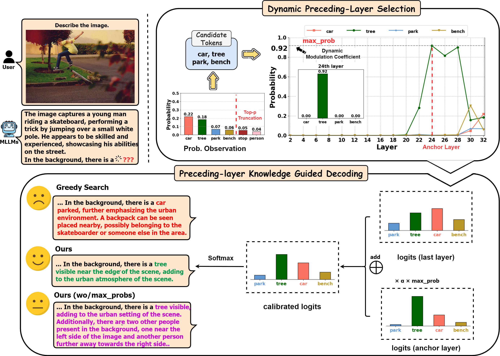

# MLLM Can See? Dynamic Correction Decoding For Hallucination Mitigation

<!-- [](https://opensource.org/licenses/MIT)
[](https://arxiv.org/abs/2410.11779)
[](https://github.com/huggingface/transformers)
[](https://github.com/shikiw/OPERA/stargazers) -->

<p align="center">
  <a href="https://www.arxiv.org/abs/2410.11779">📄arXiv</a> •
  <a href="https://huggingface.co/papers/2410.11779">🤗HFPaper</a> •
  <a href="https://notebooklm.google.com/notebook/e41ab929-0cf5-45d2-a5b7-c3c109e2baac/audio">🎧NotebookLM Audio</a>
</p>


This repository provides the official PyTorch implementation of the following paper: 
> [**MLLM Can See? Dynamic Correction Decoding For Hallucination Mitigation**](https://arxiv.org/abs/2410.11779) <br>
> Chenxi Wang<sup>1</sup>, 
> Xiang Chen<sup>1</sup>, 
> Ningyu Zhang<sup>1</sup>,
> Bozhong Tian<sup>1</sup>,
> Haoming Xu<sup>1</sup>, 
> Shumin Deng<sup>2</sup>,
> Huajun Chen<sup>1</sup> <br>
> <sup>1</sup>Zhejiang University, <sup>2</sup>National University of Singapore <br>


## Overview

<p align="center"></p>

Multimodal Large Language Models (MLLMs) frequently exhibit hallucination phenomena, but the underlying reasons remain poorly understood. In this paper, we present an empirical analysis and find that, although MLLMs incorrectly generate the targets in the final output, they are actually able to recognize visual objects in the preceding layers. We speculate that this may be due to the strong knowledge priors of the language model suppressing the visual information, leading to hallucinations. Motivated by this, we propose a novel dynamic correction decoding method for MLLMs (DeCo), which adaptively selects the appropriate preceding layers and proportionally integrates knowledge into the final layer to adjust the output logits. Note that DeCo is model agnostic and can be seamlessly incorporated with various classic decoding strategies and applied to different MLLMs. We evaluate DeCo on widely-used benchmarks, demonstrating that it can reduce hallucination rates by a large margin compared to baselines, highlighting its potential to mitigate hallucinations.

## Demo
There is a demonstration of using DeCo. We provide a handy [Jupyter Notebook](https://github.com/zjunlp/Deco/blob/main/DeCo_examples.ipynb)!
## Setup

The main implementation of Deco is in `transformers/generation/utils.py`.

```
conda create -n deco python==3.9
conda activate deco
pip install -r requirements.txt
```

## TL;DR
After setup the environment, you can directly use Deco on your own MLLM model by:
```
with torch.no_grad():
    output_dict = model.generate(
                    input_ids,
                    images=image_tensor,
                    do_sample=args.do_sample
                    temperature=args.temperature,
                    top_p=args.top_p,
                    num_beams=args.num_beams,
                    max_new_tokens=args.max_new_tokens,
                    return_dict_in_generate=True,
                    output_hidden_states=True,
                    use_deco = True,
                    alpha = 0.6,
                    threshold_top_p = 0.9, 
                    threshold_top_k = 20,
                    early_exit_layers=[i for i in range(20, 29)]
                    )
                
output_ids = output_dict.sequences
outputs = tokenizer.batch_decode(output_ids)
```
<!-- 
Please refer to `demo.ipynb` [here](https://github.com/shikiw/OPERA/blob/1e74d8b5d082579c81e0e77ef1cf4a44d20ab91e/demo.ipynb) for more details. -->


## Evaluation

The following evaluation requires for MSCOCO 2014 dataset. Please download [here](https://cocodataset.org/#home) and extract it in your data path.


### Arguments

| Argument             | Example             | Description   |
| -------------------- | ------------------- | ------------- |
| `--data-path`     | `/path/to/dataset` | Path to the dataset file or folder, e.g., `COCO_2014/val2014/`. |
| `--alpha`   | `0.5` | The scale factor to scale up the calibration strength. |
| `--threshold_top_p`      | `0.9` | The threshold for controlling the number of candidate tokens. |
| `--early-exit-layers`   | `range(20,29)` | The candidate layer interval can be adjusted appropriately according to the model. |


### CHAIR
- Generate the MLLM's responses and save them in a jsonl file:
```bash
python chair_llava.py
```
<!-- Note: Please check out our released results in `log/chair_eval_results` for reproduction. -->

- Calculate CHAIR using the generated jsonl file:
```bash
python chair.py --cap_file /path/to/jsonl --image_id_key image_id --caption_key caption --coco_path /path/to/COCO/annotations_trainval2014/annotations/ --save_path /path/to/save/jsonl
```

### AMBER
- Generate the MLLM's responses and save them in a jsonl file:
```bash
python amber_llava.py
```

- Calculate metric score using the generated jsonl file:
```bash
python inference.py
```


### POPE
```bash
python pope_eval.py 
```
### MME
```bash
python mme_llava.py
```
### Additional Experiment's Results
We compare the baseline, DoLa, DeCo, and the combination of DoLa and DeCo on the LLM benchmark, such as StrategyQA and GSM8K, using llama-7b.

| Method            | StrategyQA             | GSM8K   |
| -------------------- | ------------------- | ------------- |
| baseline    | 59.8 | 10.8 |
| DoLa   | 64.1 | 10.5 |
| DeCo      | 61.2 | 10.2 |
| DoLa+DeCo   | 60.0 | 9.6 |


We compare the baseline, DoLa, DeCo, and the combination of DoLa and DeCo on CHAIR, using llava-v1.5-7b.

| Method            | CHAIRs             | CHAIRi   |
| -------------------- | ------------------- | ------------- |
| baseline    | 45.0 | 14.7 |
| DoLa   | 47.8 | 13.8 |
| DeCo      | 37.8 | 11.1 |
| DoLa+DeCo   | 44.2 | 11.9 |

## Reference Repositories
- DoLa: https://github.com/voidism/DoLa
- OPERA: https://github.com/shikiw/OPERA
- VCD: https://github.com/DAMO-NLP-SG/VCD
- LLaVA: https://github.com/haotian-liu/LLaVA
- MiniGPT4: https://github.com/Vision-CAIR/MiniGPT-4

## Acknowledgement
The repository references the code from [DoLA](https://github.com/voidism/DoLa) and [OPERA](https://github.com/shikiw/OPERA) and utilizes MLLM codebase of [LLaVA](https://github.com/haotian-liu/LLaVA) and [MiniGPT4](https://github.com/Vision-CAIR/MiniGPT-4). We extend our gratitude to the authors for their outstanding work.


## Citation
If you find this work useful for your research, please cite [our paper](https://arxiv.org/abs/2410.11779):
```
@misc{wang2024mllmseedynamiccorrection,
      title={MLLM can see? Dynamic Correction Decoding for Hallucination Mitigation}, 
      author={Chenxi Wang and Xiang Chen and Ningyu Zhang and Bozhong Tian and Haoming Xu and Shumin Deng and Huajun Chen},
      year={2024},
      eprint={2410.11779},
      archivePrefix={arXiv},
      primaryClass={cs.CL},
      url={https://arxiv.org/abs/2410.11779}, 
}
```
